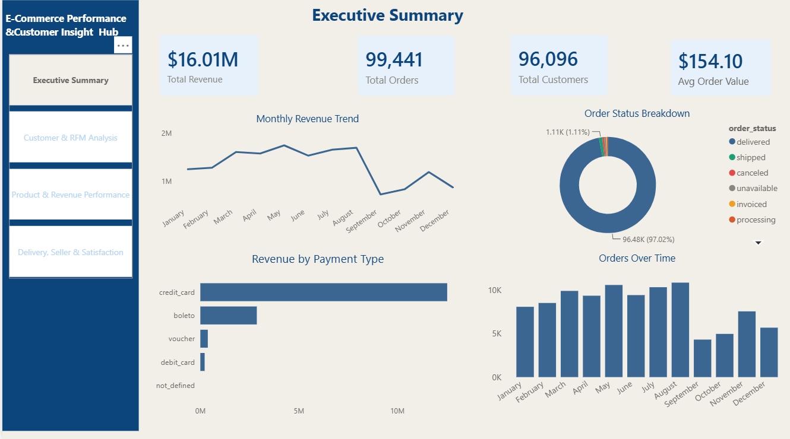
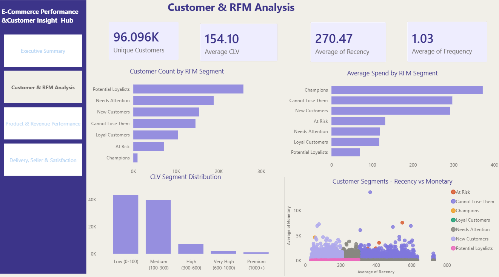
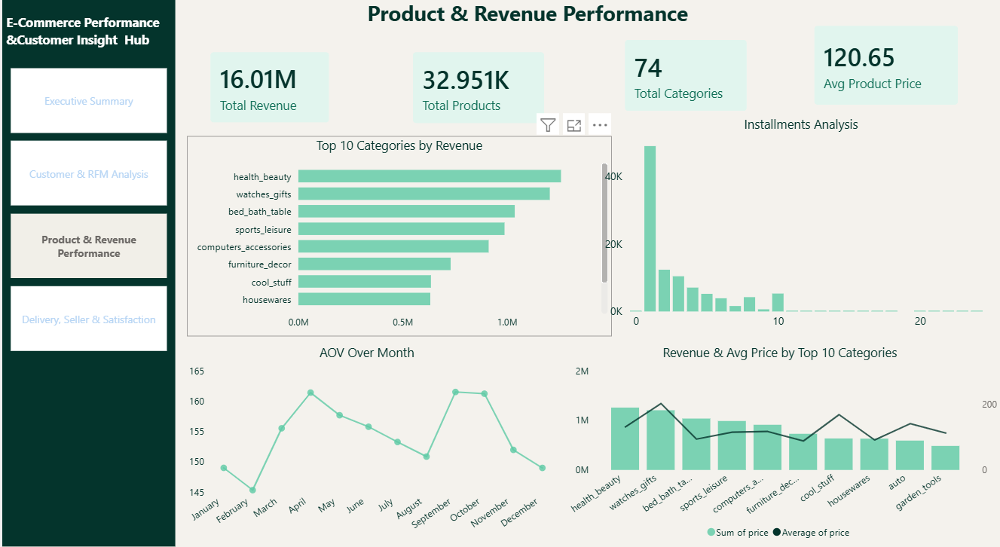
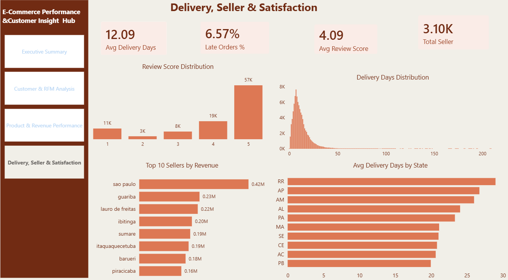

# 🛍️ E-Commerce Sales & Customer Analytics (Olist)

## 📊 Project Overview
This project analyses e-commerce order data using Python (data cleaning, feature 
engineering, exploratory analysis, RFM, CLV, cohort, seller and geolocation analysis), 
MySQL (KPI queries with CTEs and window functions), and Power BI (4-page dashboard).

📄 Files: `E-Commerce.ipynb`, `E-Commerce.sql`, `E-Commerce.pbix`

---

## 🗂 Dataset
Datasets loaded in the notebook:
- olist_customers_dataset.csv
- olist_orders_dataset.csv
- olist_order_items_dataset.csv
- olist_order_payments_dataset.csv
- olist_order_reviews_dataset.csv
- olist_products_dataset.csv
- olist_sellers_dataset.csv
- olist_geolocation_dataset.csv
- category translation file (English product category names)

---

## 🛠 Tools & Technologies
- **Python** — pandas, numpy, matplotlib, seaborn, sqlalchemy
- **MySQL** — accessed from Python via `mysql+mysqlconnector`
- **Power BI** — dashboard file `E-Commerce.pbix`

---

## 🔎 Python Analysis
📄 Notebook: `E-Commerce.ipynb`

**Data Cleaning**
- Converted order date columns to datetime
- Filled missing product category names with "unknown"; filled missing product dimensions with median values
- Filled missing review comment fields with "no comment"
- Converted `shipping_limit_date` to datetime; created `total_item_value` (price + freight_value)
- Standardised customer city (title case) and state (uppercase)
- Exported cleaned datasets to CSV, then loaded into MySQL

**Feature Engineering**
- Extracted purchase year, month, day, day-of-week, hour from purchase timestamp
- Calculated actual delivery days

**Exploratory Data Analysis (12 analyses)**
1. Orders over time
2. Order status breakdown
3. Revenue over time
4. Top product categories
5. Payment type analysis
6. Review score distribution
7. Orders by day of week & hour
8. Top 10 customer states
9. Delivery performance analysis
10. Average order value (AOV) analysis
11. Freight vs price analysis
12. Installments analysis

**RFM Analysis**
- Pulled Recency, Frequency, Monetary values from MySQL
- Scored each (1–5) using `pd.qcut`
- Segmented customers by RFM score (segments referenced in the notebook include Champions, Loyal Customers, New Customers, Potential Loyalists, At Risk)
- Exported results to MySQL as `rfm_segments`

**Cohort Analysis**
- Queried monthly new-customer counts (order-based cohort)
- Calculated cumulative customer growth over time

**Customer Lifetime Value (CLV)**
- Pulled total orders, total spend, and avg order value per customer from MySQL
- Segmented by total spend: Low (0–100), Medium (100–300), High (300–600), Very High (600–1000), Premium (1000+)
- Exported results to MySQL as `clv_segments`

**Seller Performance**
- Queried seller-level revenue, order count, avg price, avg review score, and avg delivery days from MySQL
- Visualised top 10 sellers by revenue

**Geolocation Analysis**
- Queried state-level orders, customers, revenue, avg order value, and delivery metrics from MySQL
- Visualised revenue and customer count by state

---

## 🗄 SQL Analysis
📄 SQL File: `E-Commerce.sql`

**Section 1 — Revenue Analysis**
- Total overall revenue, total orders, avg order value
- Monthly revenue trend
- Revenue by payment type
- Revenue by product category (top 10)

**Section 2 — Customer Analysis**
- Total unique customers, customer IDs, states
- Customers by state (top 10)
- Repeat vs one-time customers

**Section 3 — Order & Funnel Analysis**
- Order status breakdown (with percentage)
- Orders by day of week
- Orders by hour of day
- Average time from purchase to delivery (actual vs estimated, delay, late order count)

**Section 4 — Delivery & Seller Performance**
- Top 10 sellers by revenue
- Freight cost analysis by state (avg freight, avg price, freight % of price)

**Section 5 — RFM Pre-Calculation**
- Base query: recency, frequency, monetary per customer

**Section 6 — Review & Satisfaction Analysis**
- Overall review score distribution
- Average review score by product category (top 10)
- Review score vs delivery performance (avg delivery days, avg delay)

**Section 7 — Advanced SQL (CTEs & Window Functions)**
- Cumulative revenue growth by month (window function)
- Top 3 product categories per state (CTE + `ROW_NUMBER()`)
- Top 5 customers per state by spend (CTE + `RANK()`)

---

## 🖼 Dashboard Preview

### Page 1 — Executive Summary

### Page 2 — Customer & RFM Analysis

### Page 3 — Product & Revenue Performance

### Page 4 — Delivery, Seller & Satisfaction

---

## 💡 Key Insights

- Orders grew consistently from 2016 to a peak in November 2017; 93,358 unique customers acquired over 2 years
- 97% of customers purchased only once; only 995 of 93,357 customers (1%) are Champions; average customer lifespan is near 0 days
- 14,585 customers are in a "Cannot Lose Them" segment (high spend, gone cold); Premium customers (1,149) contribute 11.8% of revenue
- Credit card is the dominant payment method; average installments is 2.9; more installments correlates with higher spend
- Average actual delivery is 12 days vs. 23 days estimated; most orders arrive early
- Top categories dominate revenue heavily; long tail of low-performing categories
- Top seller generated R$225,586 in revenue; average seller review score is 4.15/5; some sellers show delivery outliers of up to 190 days
- São Paulo accounts for the majority of orders and revenue; remote states have higher freight costs and longer delivery times
- Average freight is R$20, roughly 15% of order value; disproportionately higher in some states

---

## 📚 Data Source
Data Soursce was downloaded from Kaggle. This project is only for portfolio and academic work only.
